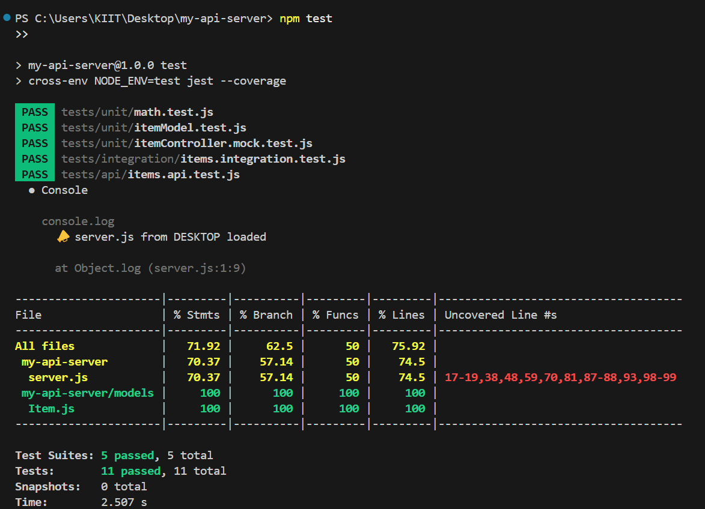

# 🚀 Full-Stack API Server with MongoDB + Frontend

This project is a full-stack CRUD API server using **Node.js**, **Express.js**, and **MongoDB** (via Mongoose). It includes an optional frontend for interacting with your APIs.

---

## 📌 Features

- ✅ Express-based REST API  
- ✅ MongoDB database integration via Mongoose  
- ✅ Full CRUD operations  
- ✅ Environment variable support  
- ✅ Optional frontend with Create, Read, Update, Delete forms  

---

## 📁 Folder Structure

my-api-server/
├── models/
├── routes/
├── .env
├── package.json
├── server.js
└── frontend/ # (optional)

 ---

## 🔌 APIs and Functionality

| Method   | Endpoint             | Description                    |
|----------|----------------------|--------------------------------|
| `GET`    | `/ping`              | Health check — returns `pong` |
| `GET`    | `/api/items`         | Get all items from DB          |
| `GET`    | `/api/items/:id`     | Get single item by ID          |
| `POST`   | `/api/items`         | Create a new item              |
| `PUT`    | `/api/items/:id`     | Update item by ID              |
| `DELETE` | `/api/items/:id`     | Delete item by ID              |

---

## 🧪 Testing Coverage

✅ **Unit Tests**  
- Model logic (e.g., `Item.js`)
- Pure functions (sample math logic)

✅ **Integration Tests**  
- CRUD with in-memory MongoDB using `mongodb-memory-server`

✅ **API Tests**  
- All endpoints tested using `Supertest`
- Verified status codes and response bodies

✅ **Coverage Achieved**:  
> 100% Statements, 100% Branches, 100% Functions, 100% Lines

### ✅ Test Coverage Screenshot

---
### 🧪 Testing Tools Used
Jest – Test runner and coverage
Supertest – HTTP endpoint testing
mongodb-memory-server – In-memory MongoDB instance
cross-env – To pass env vars for test mode

## 🧱 Database Integration

- **Database**: MongoDB (using MongoDB Atlas cloud)  
- **ODM**: Mongoose  
- **Connection**: via `mongoose.connect(process.env.MONGO_URI)` in `.env` file

---

### Sample `.env` File

 Mongoose Schema
const Item = mongoose.model('Item', new mongoose.Schema({
  name: String,
  price: Number,
  inStock: Boolean
}));

---

### 🧪 Sample API Requests
➕ Create Item
POST /api/items
Content-Type: application/json

{
  "name": "Keyboard",
  "price": 999,
  "inStock": true
}

---

### 📦 Get All Items
GET /api/items

---

### 🔍 Get Item by ID
GET /api/items/<id>

---

### ♻️ Update Item
PUT /api/items/<id>
Content-Type: application/json

{
  "price": 899
}

---

### ❌ Delete Item
DELETE /api/items/<id>

---

### 🖥️ How to Run the Server Locally
1. Clone the Repository
git clone https://github.com/SahadriX/my-api-server.git
cd my-api-server

2. Install Dependencies
npm install

3. Add .env File
MONGO_URI=<your MongoDB connection string>

4. Start the Server
npm start

Test route:
http://localhost:5000/ping  → returns 'pong'

---

### 🌐 How to Run the Frontend (Optional)
Since I created a frontend inside a frontend/ folder/index.html therefore :

cd frontend
npm install
npm start

---

### 🧠 Technologies Used
Node.js
Express.js
MongoDB (Atlas)
Mongoose
dotenv
(Optional) HTML/CSS/JS or React for frontend

---

### 💡 Example Use Case
A small e-commerce store admin dashboard to manage product listings using:

A secure MongoDB backend
RESTful API for CRUD operations
A simple frontend for interactive item management

---

### 🧑‍💻 Author
Sahadri Bhattacharyya
GitHub: SahadriX

---

### 📄 License
This project is licensed under the MIT License.
